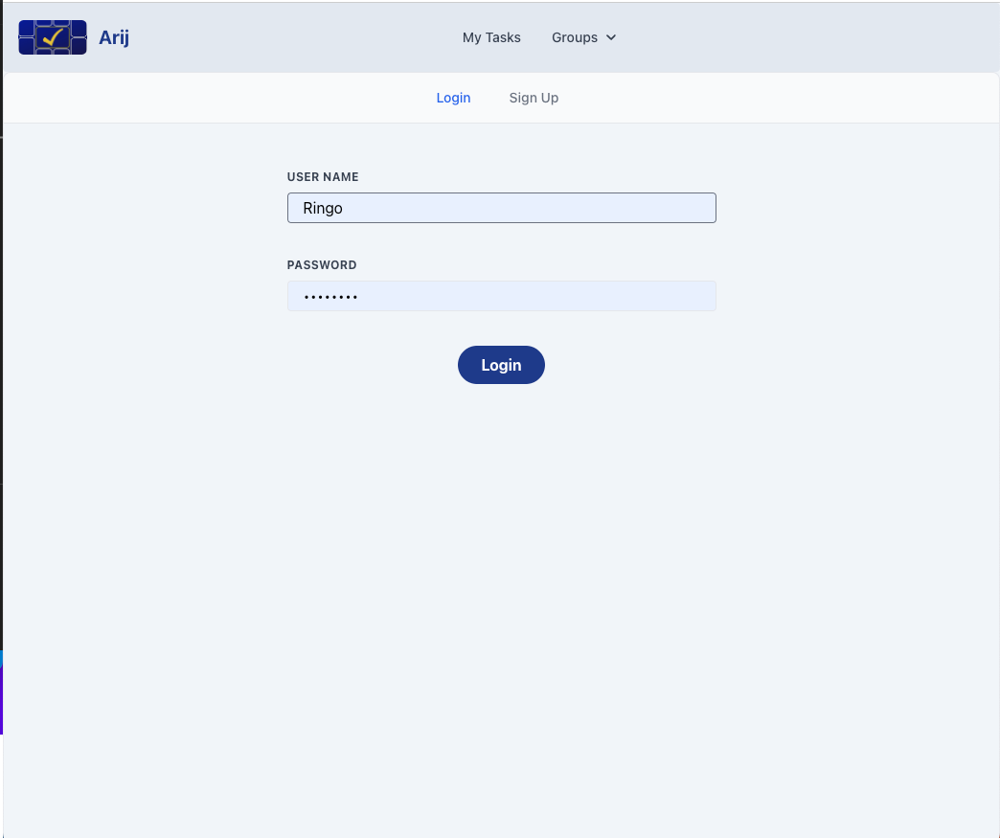
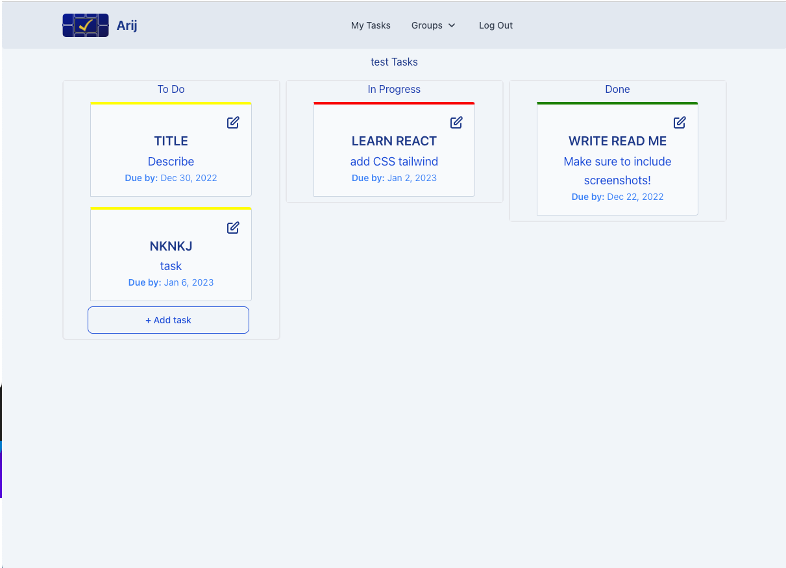
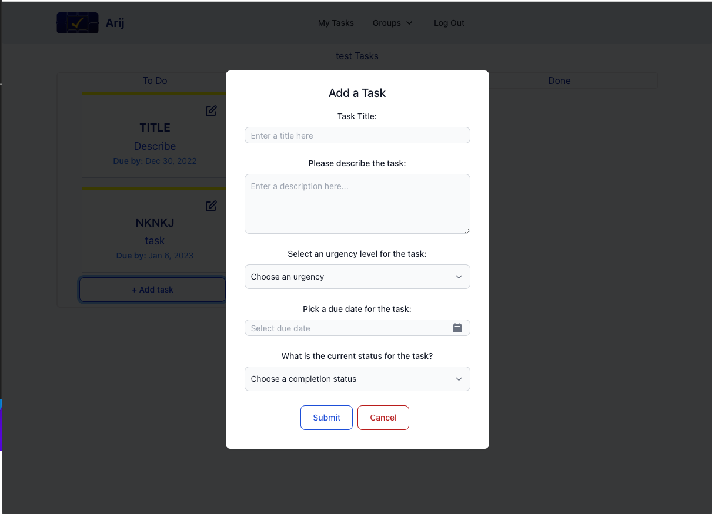
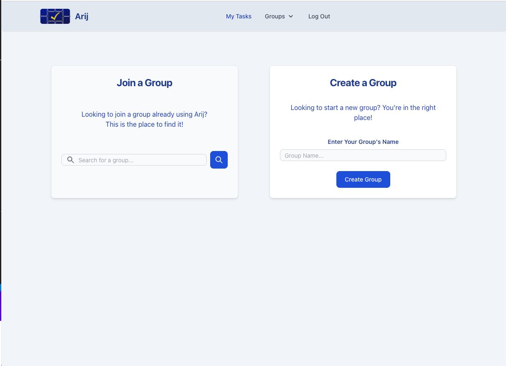

# arij
  
Arij was designed with businesses and groups in mind. You can add tasks to a shared group board, set a due date and a priority level for each task, as well as adjust it’s completion status.

[You can visit the repo here.](https://github.com/Jstelzl/arij)
[And the deployed application here.](https://pacific-cliffs-88620.herokuapp.com/)

## Table of Contents
- [Installation](#installation)
- [Usage](#usage)
- [Contributing](#contributing)
- [Tests](#tests)
- [Questions](#questions)

## Installation

No installation is required if you visit the deployed website. If you fork the repository, you will need to npm i .

## Usage

Intuitive and user friendly, Arij allows even the most scattered of us to remain organized and prioritize our time well- which is more important than ever with the holidays right around the corner! You can view all the tasks that you’ve created by completion status and priority on your page, as well as view all the tasks for the groups you have joined. 

## Contributing

Please fork to contribute.

## Tests

No tests are included with this project.

## Questions

If you have questions, please contact us on GitHub here: [APetersen11](https://github.com/APetersen11)
[Jstelzel](https://github.com/Jstelzl)
[ReeceDevenney](https://github.com/ReeceDevenney)
[richielollis](https://github.com/richielollis)

or by email here: [aptrsn11@gmail.com](mailto:aptrsn11@gmail.com)

